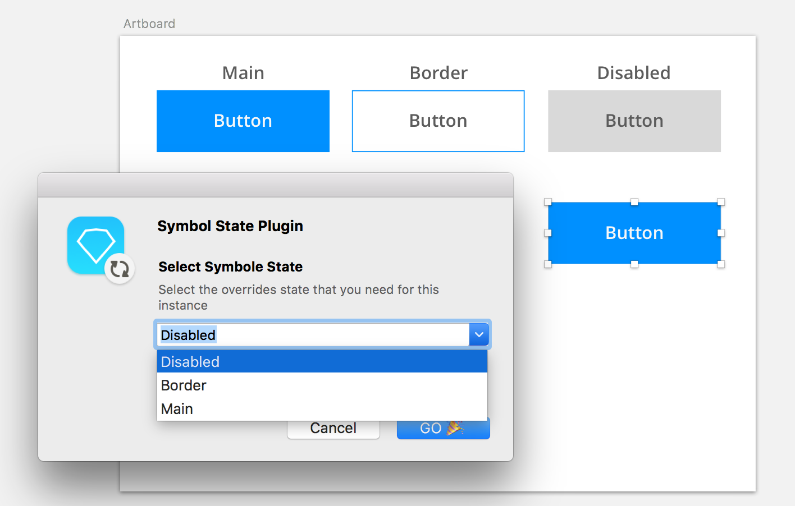

# Symbol State Sketchplugin Plugin

This plugin will make you save your overrides in any symbol in what I called "STATE", then you can re-use this overrides on any instance of this symbol
let's say we have button with nested symbols and you can change the background and the text by overrides. what if you saved each override with a name and then reuse them everywhere.
give me your thoughts and if it will be useful or not

<h1> How it works </h1>

first go to any symbol instance and modify the overrides as you wish
then go to Symbol state plugin and select Add Symbol State, After that write the name you want for this state,

<<<<<<< HEAD
then create any instance from this symbole and select from Symbole state plugin "Set Symbole State" you will find the state you saved in the this symbole in the drop down menu select it then your saved overrides will be applied to the selected instance

then create any instance from this symbol and select from Symbol state plugin "Set Symbol State" you will find the state you saved in the this symbol in the drop down menu select it then your saved overrides will be applied to the selected instance

Available on
